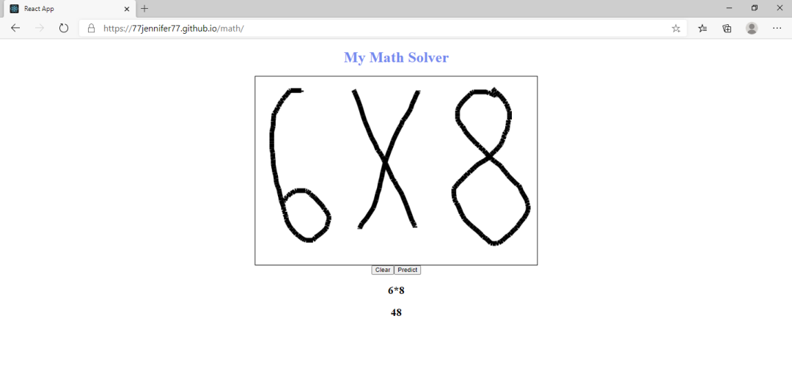
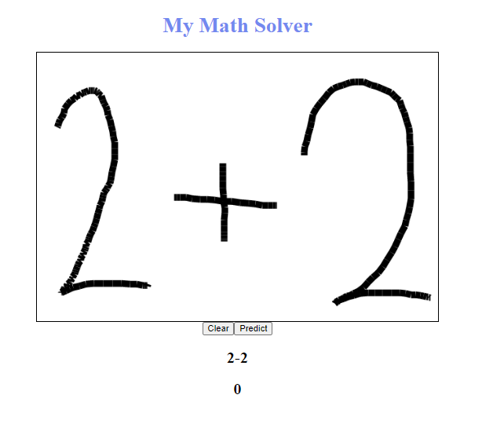

# CS-4800-Math-Solver
AI based math problem solver

<b>Technologies: </b> <i>Python, Kaggle Dataset, Tensorflow, Machine Learning, CNN(Convulutional Neural Network), Google bucket(Storage), OCR</i>

Trains for character recognition on mathematical symbols and numbers and computes the solution.

The solution can be improved upon and is noticed in our report identifying how to improve the accuracy.

